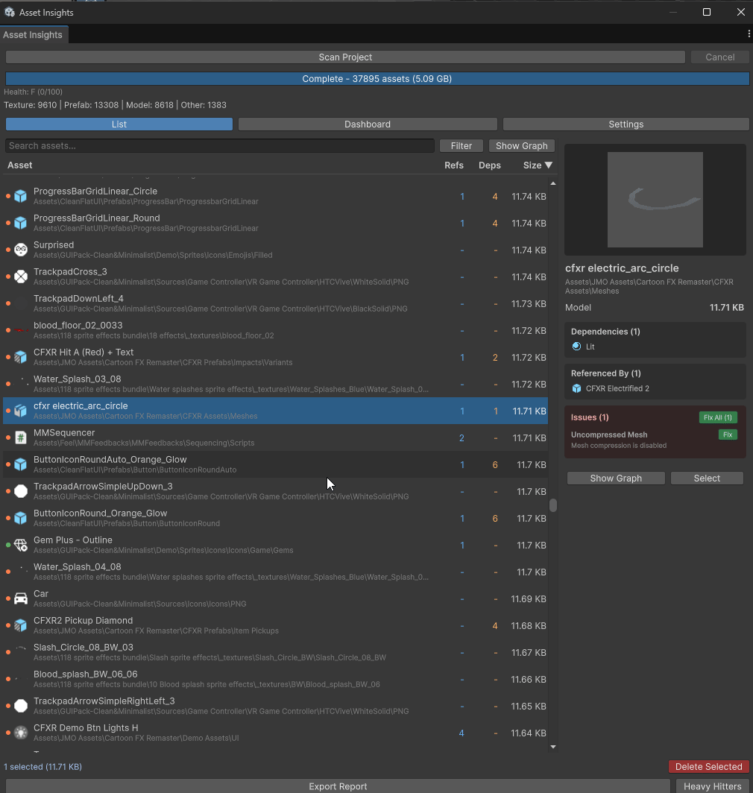
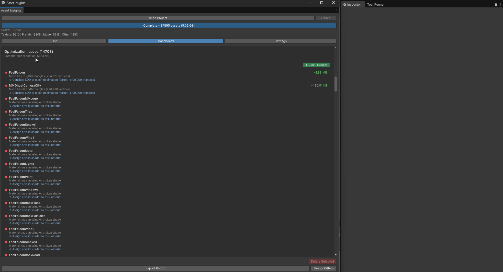

# Asset Insights

[](https://github.com/soo-bak/soobak-asset-insights/actions/workflows/unity-tests.yml)
[](https://opensource.org/licenses/MIT)
[](https://unity.com/)
[](https://github.com/soo-bak/soobak-asset-insights/stargazers)
[](https://github.com/soo-bak/soobak-asset-insights/issues)
[](https://github.com/soo-bak/soobak-asset-insights/commits/main)

A Unity Editor tool for analyzing asset dependencies, tracking size impact, and generating shareable reports.


---

## Why Asset Insights?

- **Reduce Build Size** - Identify and remove unused assets wasting storage
- **Catch Issues Early** - Detect circular dependencies before they cause problems
- **Understand Your Project** - Visualize which assets depend on what
- **Optimize Assets** - Find oversized textures and uncompressed audio
- **Team Collaboration** - Export reports in Markdown, Mermaid, or JSON

---

## Features

### Dependency Analysis
- **Why Included?** - Trace the complete dependency path from root assets to any target
- **Heavy Hitters** - Identify size-heavy assets that impact build size
- **Dependency Graph** - Visualize asset relationships in a bidirectional graph view



### Dashboard
- **Type Breakdown** - See distribution of assets by file type with size percentages
- **Largest Assets** - Quick view of top 10 space-consuming files
- **Unused Assets** - Find assets not referenced by any scene with one-click delete
- **Optimization Issues** - Detect oversized textures, uncompressed audio with auto-fix
- **Circular Dependencies** - Visualize dependency cycles with clear chain display
- **Duplicate Assets** - Find files with the same name in multiple locations



### Report Generation
- **Markdown** - Clean tables for documentation and team sharing
- **Mermaid** - Flowchart diagrams for visual dependency mapping
- **JSON** - Structured data for custom tooling integration

### Large Project Support
- Async scanning with progress tracking
- Cancellation support for long operations
- Configurable filters (by type, path, size)
- Sortable columns (Name, Refs, Deps, Size)

## Installation

### Via Git URL (UPM)
1. Open Package Manager (`Window > Package Manager`)
2. Click `+` > `Add package from git URL`
3. Enter: `https://github.com/soo-bak/soobak-asset-insights.git?path=Packages/com.soobak.asset-insights`

### Manual Installation
1. Clone this repository
2. Copy `Packages/com.soobak.asset-insights` to your project's `Packages` folder

## Quick Start

Get insights in 30 seconds:

```
1. Window > Asset Insights
2. Click "Scan Project"
3. Switch to Dashboard tab
4. Done! Review issues and click "Fix" to optimize
```

| Step | What You'll See |
|------|-----------------|
| **Dashboard** | Project health score, unused assets, optimization issues |
| **Asset List** | All assets sorted by size with dependency counts |
| **Graph View** | Visual dependency tree for any selected asset |

> **Tip:** Right-click any asset in Project window → `Asset Insights > Why Included?` to trace dependencies

## Usage

### Main Window
Open via `Window > Asset Insights`


1. Click **Scan Project** to analyze all assets
2. Browse assets sorted by size (multi-select supported)
3. Use search to filter results (Ctrl+F)
4. Export reports in your preferred format

**Keyboard Shortcuts:**
| Shortcut | Action |
|----------|--------|
| `Ctrl+F` | Focus search |
| `F5` / `Ctrl+R` | Refresh scan |
| `Ctrl+A` | Select all |
| `Delete` | Delete selected |
| `Ctrl+1/2/3` | Switch views |

### Context Menu
Right-click any asset in Project window:
- **Asset Insights > Why Included?** - Shows dependency paths
- **Asset Insights > Show Dependencies** - Lists direct dependencies

### Scripting API

```csharp
using Soobak.AssetInsights;

// Scan project
var scanner = new DependencyScanner();
scanner.ScanImmediate();

// Find dependency paths
var paths = PathFinder.FindWhyIncluded(scanner.Graph, "Assets/Texture.png");

// Generate reports
var exporter = new ReportExporter();
var markdown = exporter.ExportHeavyHitters(scanner.Graph, 20);
```

## Performance

Designed for large-scale Unity projects:

| Project Size | Assets | Scan Time | Memory |
|--------------|--------|-----------|--------|
| Small | ~1,000 | < 2s | ~50 MB |
| Medium | ~5,000 | < 5s | ~150 MB |
| Large | ~10,000 | < 10s | ~300 MB |

**Optimizations:**
- Incremental cache updates (only re-analyze changed assets)
- Batch memory cleanup during analysis
- Async scanning with cancellation support
- Smart dependency resolution with memoization

> Benchmarks measured on Unity 6 with SSD storage. Actual performance may vary based on asset complexity.

## Architecture

```
Packages/com.soobak.asset-insights/
├── Editor/
│   ├── Core/           # Models, Graph, PathFinder
│   ├── Services/       # Scanner, Exporter (with interfaces)
│   └── UI/             # EditorWindows, Context menus
└── Tests/
    └── Editor/         # NUnit test suites
```

### Design Principles
- **Interface-based** - `IDependencyScanner`, `IReportExporter` for testability
- **Layered** - Clear separation between Core, Services, and UI
- **Async-ready** - Coroutine-based scanning for large projects

## Requirements

- Unity 6 (6000.0) or later
- Editor Coroutines package (auto-installed via dependencies)

## Contributing

Contributions are welcome! Please see [CONTRIBUTING.md](CONTRIBUTING.md) for guidelines.

## License

MIT License - see [LICENSE](LICENSE) for details.
